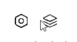
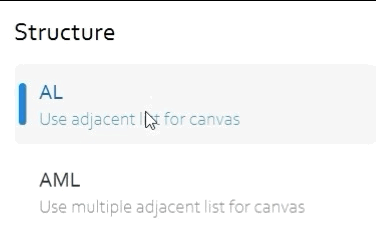
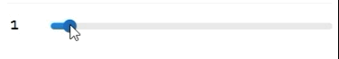
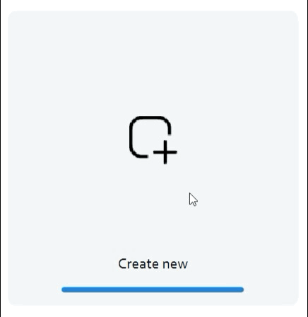
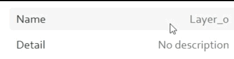
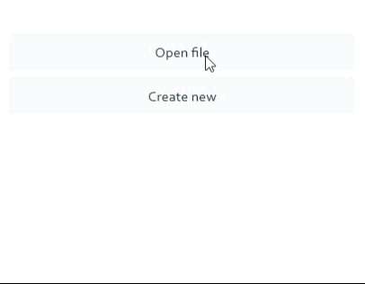
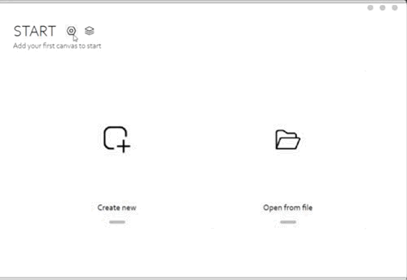
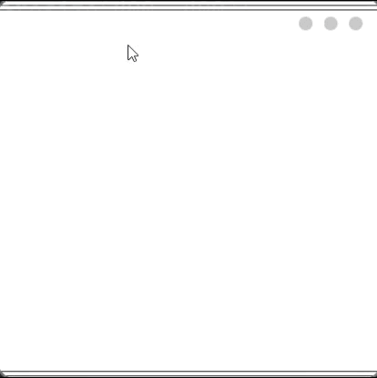

# 说明文档

## 组件

- customIcon 小按钮

- singleSelectGroup + selectionItem 项目选择框

- horizontalValueAdjuster 水平滑动条

- bigIconButton 大按钮

- textInputItem 单行信息展示/输入框

- textButton 文字按钮

  

- SheildLayer 遮罩层

- SlidePage 侧边栏

* framelesswindow 无边框窗口

